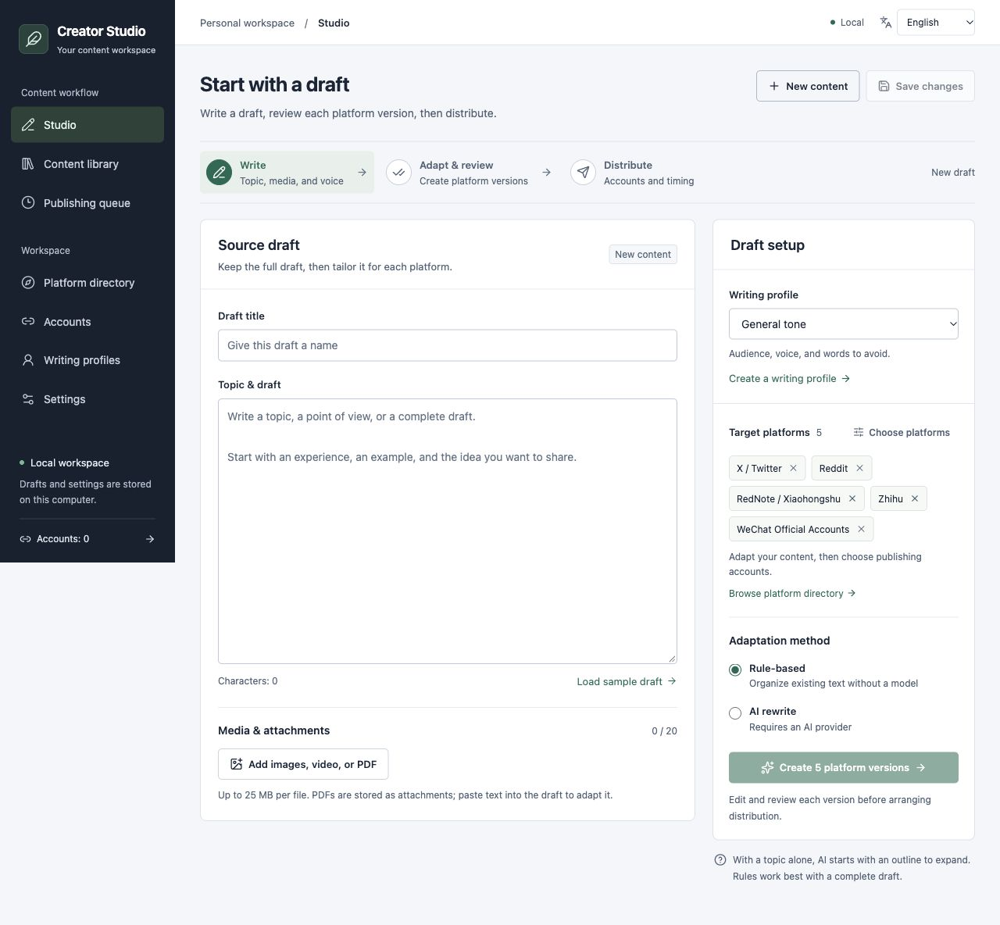

# Creator Studio

Turn one source draft into reviewed, platform-specific content, then publish, save drafts, or hand it off through your configured connections.

**English** · [简体中文](./README.zh-CN.md)



A personal workspace that runs locally or behind an authenticated server deployment. The interface defaults to English; switch between **English** and **简体中文**, with your choice saved in the browser. Interface language is separate from the output language in your writing profile.

## From draft to distribution

| Stage | What you do |
| --- | --- |
| **1. Write** | Add a topic, source text, writing profile, and images, video, or PDF attachments. |
| **2. Adapt & review** | Generate rules-based or AI versions, edit each platform's copy, check limits and media requirements, preview, and approve. |
| **3. Distribute** | Copy or export, select compatible accounts, and create immediate or scheduled tasks. Follow each target's actual result. |

## Core features

- **One source, separate versions.** Keep a content library and reusable writing profiles. Generate missing versions without overwriting existing edits; regeneration requires explicit replacement.
- **Rules or your own AI service.** Rules-based adaptation works without a model. AI uses a configured Chat Completions-compatible service and processes up to six platforms per batch.
- **Review before sending.** Edit titles, bodies, tags, and X threads; preview article HTML; check platform constraints. Source or profile changes require another review.
- **A searchable platform directory.** Filter 102 adaptation targets by region, format, and available publishing route, with requirements and experimental adapters identified.
- **Accountable distribution.** Each account gets an immutable task snapshot, schedule, and result. Drafts, browser handoffs, and uncertain outcomes stay distinct from published content. Uncertain publishing requests are never automatically resent.
- **Portable content and private credentials.** Export Markdown, article HTML, or JSON. Store account secrets and model keys encrypted in SQLite, with browser draft backup and explicit server-side saves.

## Get started

Requires **Node.js 22.13+** and npm. SQLite is built into Node; the workbench itself needs no separate database server or Redis.

```bash
git clone https://github.com/EthanAlgoX/creator-platform.git
cd creator-platform
npm ci
npm run dev
```

Open [http://127.0.0.1:4317](http://127.0.0.1:4317). The development API runs on port `4318`; Vite proxies `/api` and `/uploads`.

To build and run a single local production service:

```bash
npm run build
npm run start:production
```

Open [http://127.0.0.1:4318](http://127.0.0.1:4318). This command runs compiled JavaScript; build before starting. Optional environment variables are documented in [`.env.example`](./.env.example); the local process does not automatically load an `.env` file.

For authenticated Docker/Nginx hosting, including `/creator-platform/` deployments, follow the [deployment guide](./deploy/README.md). Remote mode is explicit; the default local service accepts loopback access. This remains a single-user workspace.

## Platform coverage and connections

The catalog contains **102 content adaptation targets: 61 domestic Chinese targets and 41 global targets**. This is a writing and formatting catalog, not a claim that every target supports unattended publishing. Connection sets overlap; do not add their counts together.

| Connection | Current scope | What is required |
| --- | --- | --- |
| Native APIs and webhooks | 18 connectors; publishing or drafts depend on the connector | Your platform credentials, resource IDs, permissions, and quotas. Enterprise bot checks validate configuration only; Teams acceptance needs delivery confirmation. |
| Postiz | 32 provider mappings; publish tasks or Postiz drafts | An accessible Postiz instance, authorized accounts, and provider-specific settings. Local files upload to Postiz's media API. |
| MultiPost | 69 public registration keys; foreground browser handoff | An installed extension, trusted workbench hostname, and target-site login. The user completes the action; some upstream adapters are experimental. |
| Wechatsync | 17 draft mappings | A reachable HTTP bridge, browser extension, and logged-in accounts. Final publication happens on the target site. |
| Xiaohongshu MCP REST | Image posts or a single same-host MP4 | A separately running, logged-in service. The video route requires shared local file access; remote/container path mapping is not implemented. |
| Custom webhook | Any catalog target with your own receiver | You supply the publishing service and authorization. Only explicit remote results count as published or drafted. |

Quora, Qiita, Zenn, and note currently have no dedicated publishing integration; use copy/export or provide your own webhook. Video targets adapt text; you supply the video file. Scheduled tasks run while the service is running, and browser handoffs still require foreground interaction.

Authenticated server uploads are private. Routes that depend on third parties downloading those URLs are restricted; use a connector that uploads file bytes directly. See the [full platform matrix](./docs/PLATFORM-COVERAGE.md) and [user guide](./docs/USER-GUIDE.md) for media, draft, and permission boundaries.

## Documentation

- [User guide](./docs/USER-GUIDE.md) — writing, AI, accounts, connection fields, task states, and backups; English.
- [Platform coverage](./docs/PLATFORM-COVERAGE.md) — every target and its implemented routes; Chinese.
- [Deployment guide](./deploy/README.md) — protected server setup and operations; Chinese.
- [Reference analysis](./docs/REFERENCE-ANALYSIS.md) — source projects, implementation choices, and license boundaries; Chinese.
- [English-first validation](./docs/LOCALIZATION-VALIDATION.md) — bilingual UI, responsive layout, content preservation, and 139 passing tests; English.
- [Validation record](./docs/VALIDATION.md) and [server deployment record](./docs/SERVER-DEPLOYMENT-20261003.md) — dated evidence and remaining live-account checks; Chinese.

## Validation

```bash
npm run typecheck
npm test
npm run build
```

Automated checks use temporary SQLite databases, mock HTTP services, and fake browser messages. They verify workflow and protocol behavior; they do not prove that a real account has publishing permission. No real social-platform posts were made during development validation.

## Data and backups

Data defaults to `data/`, or the directory specified by `CREATOR_DATA_DIR`. Stop the service before a file-copy backup and copy the **entire directory**, including `creator.sqlite`, `vault.key`, and `uploads/`. The database and key must stay together to recover saved credentials. Account and AI secrets are encrypted; ordinary drafts, profiles, and task records are not full-database encrypted. Keep private data and credentials out of Git. See [backup and restore](./docs/USER-GUIDE.md#backup-and-restore).
